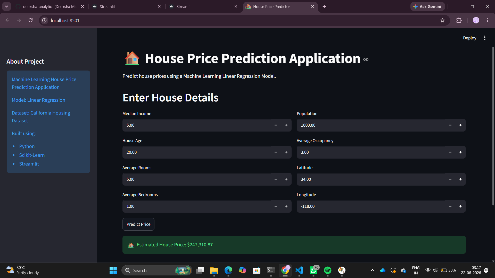

# House Price Prediction Application

## Project Overview
This project predicts house prices using Machine Learning.
The application uses a Linear Regression model trained on the California Housing Dataset.

## Technologies Used
- Python
- Pandas
- NumPy
- Scikit-Learn
- Streamlit

## Features
- Predict house prices in real time
- User-friendly web interface
- Interactive input form
- Machine Learning model integration

## Machine Learning Workflow
1. Data Collection
2. Data Preprocessing
3. Exploratory Data Analysis
4. Model Training
5. Model Evaluation
6. Deployment using Streamlit

## Model Performance
- MAE: 0.533
- R² Score: 0.576

## How to Run
```bash
pip install -r requirements.txt
streamlit run app.py
```
## Application Preview

## Project Overview
This project predicts house prices using Machine Learning.